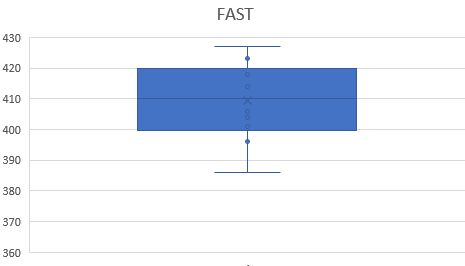
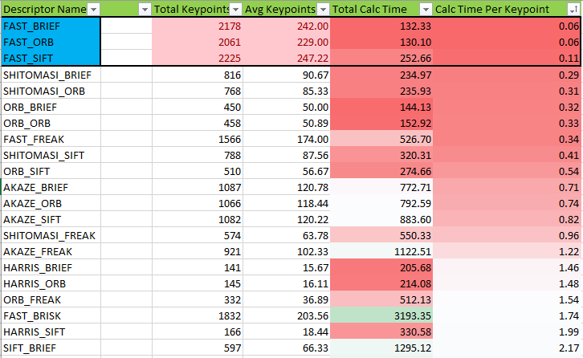

# SFND 2D Feature Tracking


## Project Related Tasks

### MP.1 Data Buffer Optimization

A ring buffer was implemented to avoid high memory usage and have new images pushed into the buffer in circular fashion, which a fixed data buffer size, i.e. 2. Thus, simply pushing new elements from front and removing others at the end. For this the `erase()` method is useful.

```c++

// push image into data frame buffer
DataFrame frame;
frame.cameraImg = imgGray;
std::cout << "===========================================================================================\n";
std::cout << "\n[KKLOG]: Ring Buffer Size = " << dataBuffer.size() << std::endl;

// Check for the dataBuffer size
// Add +1 to consider the additional push_back
if( dataBuffer.size()+1 > dataBufferSize )
{
  dataBuffer.erase( dataBuffer.begin() );
  std::cout << "\n[KKLOG]: RingBuffer Full! Overwrite image in buffer\n";
}

dataBuffer.push_back(frame);

```

The associated code can be found here: [MP.1](./src/MidTermProject_Camera_Student.cpp#L134)

### MP.2 Keypoint Detection

A dynamic selection of different detection algorithms was implemented. The following detectors can be passed as string to the method detKeypointsModern():

* FAST
* BRISK
* ORB
* AKAZE
* SIFT

For the above, a simple string comparison is done and the respective opencv method is invoked and the `keypoints` are returned (by reference). For simplicity, the detectors were pushed into a `vector<string>` This helped in searching using `std::find()`

For Harris and Shitomasi detectors following methods will be invoked detKeypointsHarris and detKeypointsShiTomasi respectively.

```c++
if (detectorType.compare("SHITOMASI") == 0)
{
  detKeypointsShiTomasi(keypoints, imgGray, false);
}
else if(detectorType.compare("HARRIS") == 0)
{
  detKeypointsHarris(keypoints, imgGray, false);
}
else if(std::find(allDetectorTypes.begin(), allDetectorTypes.end(), detectorType)!= allDetectorTypes.end())
{
  detKeypointsModern(keypoints, imgGray, detectorType, false);
}
```

The code could be found at [MP.2](./src/MidTermProject_Camera_Student.cpp#L164)

### MP.3 Keypoint Removal

The keypoints returned by detectors from the code implemented in the task MP.2 was filtered to provide keypoints which lies within the pre-defined rectangle provided in the exercise. This allowed to focus only on the region of interest. This reduces the computation complexity by discarding points of non-interest e.g. road, bridge etc.

To implement this, a `for loop` was run on the keypoints returned by detectors. If the point on the rectangle (ROI) is in the points within the keypoint, the `keypoint->pt` was saved and pushed to `ROI vector`. At the end, we have a filtered vector of keypoints.

```c++
for(it_keypoint = keypoints.begin(); it_keypoint != keypoints.end(); ++it_keypoint)
{
  if( vehicleRect.contains(it_keypoint->pt) )
  {
    cv::KeyPoint tempKeyPoint;
    tempKeyPoint.pt = cv::Point2d(it_keypoint->pt);
    tempKeyPoint.size = 1;
    region_of_interest.push_back(tempKeyPoint);
  }
}
```

The code for this can be found at: [MP.3](./src/MidTermProject_Camera_Student.cpp#L182)

### MP.4 Keypoint Descriptors

Similar to the detectors, a dynamic selection of different description algorithms was implemented. The following descriptions can be passed as string to the method descKeypoints():

* BRISK
* BRIEF
* ORB
* FREAK
* AKAZE
* SIFT

For the above, a simple string comparison is done and the respective opencv method is invoked and the `keypoints` are returned (by reference).

The code could be found at [MP.4](./src/MidTermProject_Camera_Student.cpp#L244)

### MP.5 Descriptor Matching

1. *FLANN* matching desciptor was implemented. As suggested in the lecture, special check was introduced to avoid data type mismtach issue. It was required for both variables `descSource` and `descRef`. The code can be found at: [MP.5 FLANN](./matching2D_Student.cpp:21)

2. *KNN* was also implemented with `k=2`. The code can be found at: [MP.5 KNN](./src/matching2D_Student.cpp:35)

### MP.6 Descriptor Distance Ratio

The minimum distance ratio was set to 0.8 in the code implementing KNN. The matches were filtered this descriptor distance ratio. A simple if check 
```c++ 
if( ((*it)[0].distance) < (minDescDistRatio * (*it)[1].distance) ) 
```
The code can be found at: [MP.6 KNN](./src/matching2D_Student.cpp#L42)

### MP.7 Performance Evaluation 1

The total number of keypoints for each detectors were counted and dumped into a csv file `Keypoints_Task_MP7_Detectors.csv`. A `for loop` was run on the `vector<string> allDetectorTypes`, following which the current string within loop was passed to the method implemented in task MP.4.

```c++
for( auto current_detector : allDetectorTypes )
{
  bool isWriteDetector = true;
  ....
  // To avoid repeated code lines, code have been omitted from the write up, please click below to go to the code
  ....
}
```

Please click here to go to the code: [MP.7](./src/MidTermProject_Camera_Student.cpp#L76)

A flag `isWriteDetector` was introduced to keep track when to make an entry in the csv file, and when to skip. This helped in the next task MP.8.

**Observations**:

Detector Name | Img1 | Img2 | Img3  | Img4  | Img5 | Img6 | Img7  | Img8  | Img9  | Img10
--------  | ------- | ------|---- | ------| -------|------ | ------ | --------| ------ | --------
SHITOMASI	|125|	118|	123|	120|	120	|113	|114	|123|	111|	112
HARRIS	|17	|14	|18|	21|	26 |	43	|18|	31|	26|	34
FAST	|419	|427	|404|	423	|386	|414	|418|	406	|396|	401
BRISK	|264	|282	|282|	277	|297	|279	|289|	272	|266|	254
ORB	|92	|102	|106|	113|	109|	125	|130	|129|	127|	128
AKAZE	|166	|157|	161	|155|	163|	164|	173|	175|	177|	179
SIFT	|138	|132|	124	|137|	134	|140|	137	|148	|159	|137


**Distribution of the detected keypoints**

  
 
 


**Range Of the Detected Keypoints**

DETECTOR NAME | Keypoints Detected
--------  | -------------------
SHITOMASI | 111 ~ 125
HARRIS    |  14 ~  43
FAST      | 386 ~ 427
BRISK     | 254 ~ 297
ORB       |  92 ~ 130
AKAZE     | 155 ~ 179
SIFT      | 124 ~ 159

CSV: [MP.7](./Keypoints_Task_MP7_Detectors.csv)

### MP.8 Performance Evaluation 2

A nested loop for descriptors was implemented with the for loop of the detectors. This way all the possible combinations except `AKAZE_AKAZE` was done. A csv file was created to dump the matches count information for each of the combinations. The code for this task can be found at: [MP.8](./src/MidTermProject_Camera_Student.cpp#L80)

The csv file with all the counted values is located at: [MP.8](./Keypoints_Task_MP8_Descriptors.csv)

### MP.9 Performance Evaluation 3

The time taken by the detectors to detect the keypoints, filtering keypoints around ROI, descriptors and then matching keypoints was computed and dumped into an csv file `Log_Time_Task_MP9.csv`. Link: [MP.9](./Log_Time_Task_MP9.csv)

TOP | Descriptor Name	|	TOTAL |	AVERAGE |	STD DEV | 	CALC TIME | AVG CAL TIME
----|------------|-------|---------|----------|--------|---------
1 |FAST_BRIEF	|	2178	|242,0	|11,3|	202.138 | 0.09
2 |FAST_ORB	|	2049|	227,7	|8,5|	243.119 | 0.12
3 |FAST_SIFT|		2225	|247,2|	9,4	|391.366 | 0.18

For evaluating the TOP 3, following were considered:



First the results were sorted on average time required per keypoint in ascending order. Then the methods with maximum number and maximum average of keypoints were detected. Finally, the top 3 methods with minimum avg time per keypoint and maximum avg keypoints were chosen.

For more, refer to [TOP3](./Analysis.csv)

### Project Description

The idea of the camera course is to build a collision detection system - that's the overall goal for the Final Project. As a preparation for this, you will now build the feature tracking part and test various detector / descriptor combinations to see which ones perform best. This mid-term project consists of four parts:

* First, you will focus on loading images, setting up data structures and putting everything into a ring buffer to optimize memory load. 
* Then, you will integrate several keypoint detectors such as HARRIS, FAST, BRISK and SIFT and compare them with regard to number of keypoints and speed. 
* In the next part, you will then focus on descriptor extraction and matching using brute force and also the FLANN approach we discussed in the previous lesson. 
* In the last part, once the code framework is complete, you will test the various algorithms in different combinations and compare them with regard to some performance measures. 

See the classroom instruction and code comments for more details on each of these parts. Once you are finished with this project, the keypoint matching part will be set up and you can proceed to the next lesson, where the focus is on integrating Lidar points and on object detection using deep-learning. 

## Dependencies for Running Locally
* cmake >= 2.8
  * All OSes: [click here for installation instructions](https://cmake.org/install/)
* make >= 4.1 (Linux, Mac), 3.81 (Windows)
  * Linux: make is installed by default on most Linux distros
  * Mac: [install Xcode command line tools to get make](https://developer.apple.com/xcode/features/)
  * Windows: [Click here for installation instructions](http://gnuwin32.sourceforge.net/packages/make.htm)
* OpenCV >= 4.1
  * This must be compiled from source using the `-D OPENCV_ENABLE_NONFREE=ON` cmake flag for testing the SIFT and SURF detectors.
  * The OpenCV 4.1.0 source code can be found [here](https://github.com/opencv/opencv/tree/4.1.0)
* gcc/g++ >= 5.4
  * Linux: gcc / g++ is installed by default on most Linux distros
  * Mac: same deal as make - [install Xcode command line tools](https://developer.apple.com/xcode/features/)
  * Windows: recommend using [MinGW](http://www.mingw.org/)

## Basic Build Instructions

1. Clone this repo.
2. Make a build directory in the top level directory: `mkdir build && cd build`
3. Compile: `cmake .. && make`
4. Run it: `./2D_feature_tracking`.
