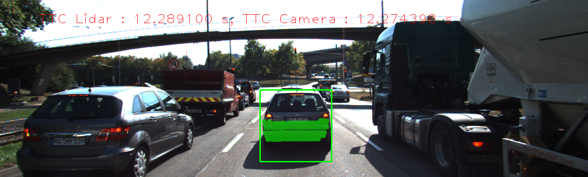
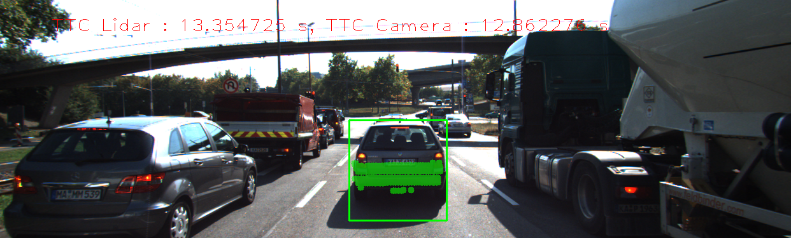
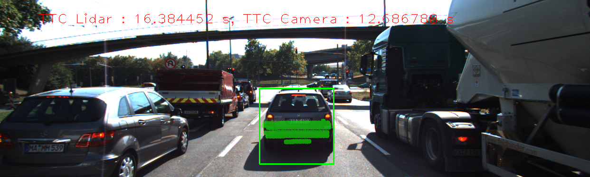
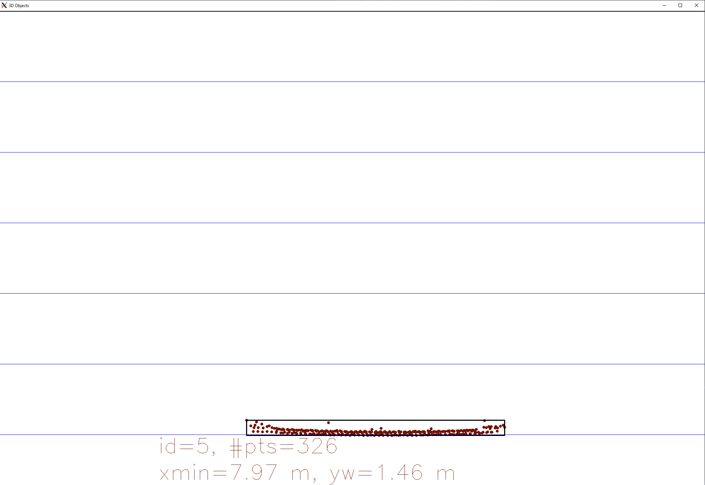
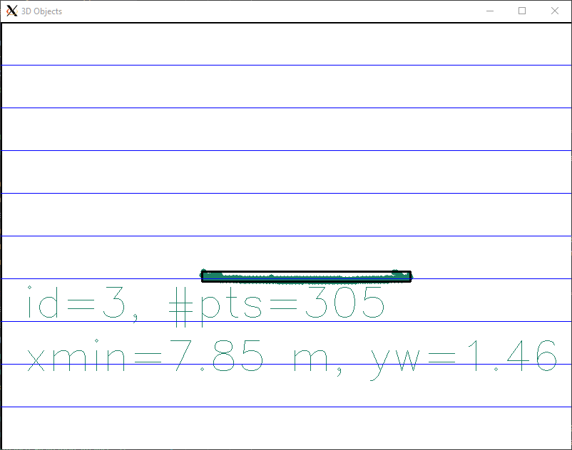
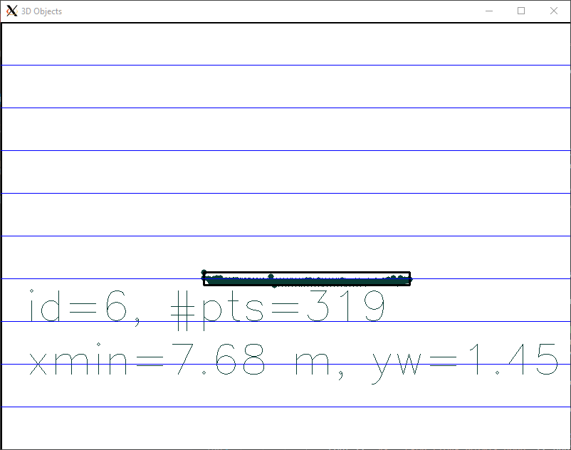
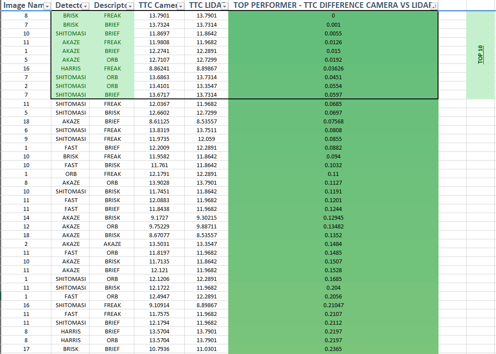
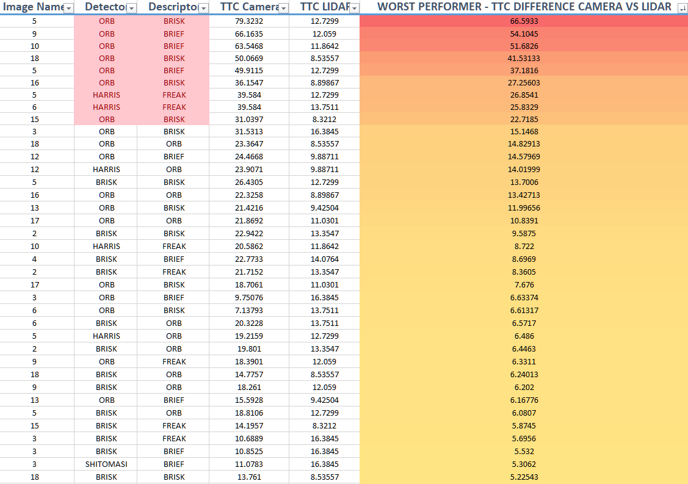
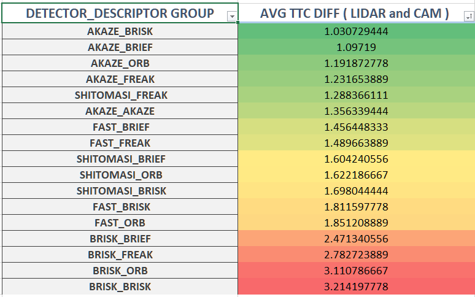

# SFND 3D Object Tracking


[Rubric Points: ](https://review.udacity.com/#!/rubrics/2550/view)

## FP.1 Match 3D Objects
Refer to the code here: [matchBoundingBoxes FP.1](./src/camFusion_Student.cpp#L294)

The method `matchBoudingBoxes()` uses multimap to store the box ids.

1. Fetch the query and training points from the previous and current frames respectively.

    ```cpp
    // Get the query and training points from resp frames
    cv::KeyPoint keyPointQuery = prevFrame.keypoints[matchIndex.queryIdx];
    cv::KeyPoint keyPointTrain = currFrame.keypoints[matchIndex.trainIdx];

    // Create the points
    cv::Point pointFromQuery = cv::Point( keyPointQuery.pt.x, keyPointQuery.pt.y);
    cv::Point pointFromTrain = cv::Point( keyPointTrain.pt.x, keyPointTrain.pt.y);

2. The fetched points were checked for the presence in previous and current bounding boxes. The found box ids were added to a MultiMap `std::multimap<int, int> mMapForMatches;`
      ```cpp
      // Search for the query point in the bounding box ROI
      for( auto previousFrameIndex:  prevFrame.boundingBoxes )
      {
          if(previousFrameIndex.roi.contains(pointFromQuery))
          {
              foundPrevBoxId = previousFrameIndex.boxID;
          }
      }

      // Search for the train point in the bounding box ROI
      for( auto currentFrameIndex : currFrame.boundingBoxes )
      {
          if(currentFrameIndex.roi.contains(pointFromTrain))
          {
              foundCurrBoxId = currentFrameIndex.boxID;
          }
      }
      mMapForMatches.insert(std::pair<int, int>(foundCurrBoxId, foundPrevBoxId));

3. Store the current frame box ids in a vector. Iterate it and find the range which equals to each boxids using `equal_range()`. Use it to increase the count in the vector.

    ```cpp
    // Temp vector to store the box Ids for the current frame
    vector<int> currFrameBoxIDs;

    for (auto box : currFrame.boundingBoxes) 
    {
        currFrameBoxIDs.push_back(box.boxID);
    }

    // Iterate through the vector with boxIds for current frame
    for( auto index : currFrameBoxIDs )
    {
        int count = 0;

        // This helps to get the range that includes all the elements in the multimap which have a key equal to index
        auto rangeBoxIds = mMapForMatches.equal_range(index);

        // Create a vector of counts (per current bbox) of prevBoxIDs
        std::vector<int> counts(maxPrevBoxID + 1, 0);
        
        // Iterate the found range
        for (auto it = rangeBoxIds.first; it != rangeBoxIds.second; ++it) 
        {
            // Increment the value
            if ((*it).second != -1) 
            {
                counts[(*it).second] += 1;
            }
        }

4. Finally, find the maximum index in the vector and make an entry in the bbBestMatches map

    ```cpp
    // Fetch the maximum index using std::distance
    // It will be the most likely match boxID of the previous frame
    int maxVectorIndex = std::distance(counts.begin(), std::max_element(counts.begin(), counts.end()));

    bbBestMatches.insert({maxVectorIndex, index});

## FP.2 Compute Lidar-based TTC
Refer to the code here: [TTC from LIDAR FP.2](./src/camFusion_Student.cpp#L242)
1. The constant velocity model equation was used to do this calculation
    ```cpp
    TTC = d1 * (1.0 / frameRate) / (d0 - d1);

2. A median value minXPrev and minXCurr was calculate to minimize the effect of outliers on the computed TTC.
    ```cpp
    if (lidarPointsPrev.size() > 0)
    {
      for (auto x: vecPrevPoints)
            minXPrev += x;
      minXPrev = minXPrev / lidarPointsPrev.size();
    }

    if (lidarPointsCurr.size() > 0)
    {
      for (auto x: vecCurrPoints)
          minXCurr += x;
      minXCurr = minXCurr / lidarPointsCurr.size();
    }

## FP.3 Associate Keypoint Correspondences with Bounding Boxes
Refer to the code here: [Keypoint Correspondences FP.3](./src/camFusion_Student.cpp#L135)
For each bounding box the method [clusterKptMatchesWithROI](./src/camFusion_Student.cpp#L135) is called. It does the following:

1. It iterates over the keypoint matches and look for the point in the matches within the current keypoints vector. If found, its added to the keypoint vector which falls in ROI.
    ```cpp
    // Iterate over the current keypoint matches
    for (cv::DMatch match : kptMatches) {
        if (boundingBox.roi.contains(kptsCurr[match.trainIdx].pt)) {
            keypointMatchesROI.push_back(match);
        }
    }

2. Compute the mean distance for the keypoints to handle the outliers.

    ```cpp
    for(auto kpMatch: keypointMatchesROI)
    {
        sumDistance += kpMatch.distance;
    }

    int kpVectorSize = keypointMatchesROI.size();

    if( kpVectorSize > 0 )
    {
        meanDistance = sumDistance / kpVectorSize;
    }

3. Check if the `kpMatch.distance` value is below the threshold distance computed using [step 2](./README.md#L120) and a threshold factor. If true, add it to the filtered bounding boxes.

    ```cpp
    const double c_THRESHOLD_FACTOR = 0.7;

    double thresholdDistance = meanDistance * c_THRESHOLD_FACTOR;
    
    for( auto kpMatch: keypointMatchesROI )
    {
        if( kpMatch.distance < thresholdDistance )
        {
            // Add the keypoint to filtered bounding boxes
            boundingBox.kptMatches.push_back(kpMatch);
        }
    }

## FP.4 Compute Camera-based TTC
Refer to the code here: [Camera Based TTC](./src/camFusion_Student.cpp#L184)
1. The main equation used to compute TTC is below:
    
    ```cpp
    TTC = (-1.0 / frameRate) / (1 - medianDistRatio);

2. The code is mainly taken from the lesson describing the TTC computation using CAMERA. The code searches the rate of change of scale in consecutive images/frames using the distance ratios on matched keypoints.
3. It reduces the impact of outliers by computing median distance ratio
     ```cpp 
    std::sort(distRatios.begin(), distRatios.end());
    long medIndex = floor(distRatios.size() / 2.0);
    double medDistRatio = distRatios.size() % 2 == 0 ? (distRatios[medIndex - 1] + distRatios[medIndex]) / 2.0 : distRatios[medIndex]; // compute median dist. ratio to remove outlier influence


## FP.5 Performance Evaluation 1
The performance evaluation was done by using code from the mid term project. The TTC computation was run was every detector and descriptor combination resulting in the following CSV file: [Performance_Evaluation_FP_6.csv](./Performance_Evaluation_FP_6.csv). The TTC overlay images for each detector descriptor combination are stored in dir: [PerformanceDataImgs/]("./PerformanceDataImgs/")

The outliers effect on the TTC computation was reduced by using the median, instead of the closest found point. However, still there were few frames where the TTC computed from LIDAR didnt match the manual walkthrough over the images. For e.g. :
| 1st Frame  | 2nd Frame   | 3rd Frame  | 
|---|---|---|
|   |   |   |

Top View:

| 1st Frame  | 2nd Frame   | 3rd Frame  | 
|---|---|---|
|   |   |   |

Some points detected by the lidar belongs to preceding vehicles mirror, which induces an error in TTC computation.

## FP.6 Performance Evaluation 2
The decriptor and detector combination was run with regards to the TTC computation frame by frame basis. The results are dumpted in the following file: [Performance_Evaluation_FP_6.csv](./Performance_Evaluation_FP_6.csv). There are two more csv files which entails the analysis:
1. [Performance_Evaluation_Analysis_Dect_desp_group.xlsx](./Performance_Evaluation_Analysis_Dect_desp_group.xlsx) Contains the group wise analysis for each detector-decriptor group.
2. [Performance_Evaluation_Analysis_top_worst_performer.xlsx](./Performance_Evaluation_Analysis_top_worst_performer.xlsx) Contains top and worst performers for overall image dataset.

### Results:
  __Performance of detector/descriptor combination on the entire image dataset:__
  
  *TOP/WORST 5*

  | TOP PERFORMER  | WORST PERFORMER   | 
  |---|---|
  | BRISK_FREAK | ORB_BRISK |
  |BRISK_BRIEF | ORB_BRIEF |
  |SHITOMASI_BRIEF | HARRIS_FREAK |
  |AKAZE_FREAK | ORB_BRISK |
  |AKAZE_BRIEF | ORB_ORB |


  |   |   |

  Note: Please ignore the duplicate det/desc combination in the chart above.
  Refer: [Performance_Evaluation_Analysis_top_worst_performer.xlsx](./Performance_Evaluation_Analysis_top_worst_performer.xlsx)

  __Groupwise performance of detector/descriptor combination:__

  | TOP PERFORMER  | WORST PERFORMER   | 
  |---|---|
  |AKAZE_BRISK|BRISK_BRISK|
  |AKAZE_BRIEF|BRISK_ORB|
  |AKAZE_ORB|BRISK_FREAK|

  Green: Best Performer
  Red: Worst Performer

   
  
  Refer: [Performance_Evaluation_Analysis_Dect_desp_group.xlsx](./Performance_Evaluation_Analysis_Dect_desp_group.xlsx)

In this final project, you will implement the missing parts in the schematic. To do this, you will complete four major tasks: 
1. First, you will develop a way to match 3D objects over time by using keypoint correspondences. 
2. Second, you will compute the TTC based on Lidar measurements. 
3. You will then proceed to do the same using the camera, which requires to first associate keypoint matches to regions of interest and then to compute the TTC based on those matches. 
4. And lastly, you will conduct various tests with the framework. Your goal is to identify the most suitable detector/descriptor combination for TTC estimation and also to search for problems that can lead to faulty measurements by the camera or Lidar sensor. In the last course of this Nanodegree, you will learn about the Kalman filter, which is a great way to combine the two independent TTC measurements into an improved version which is much more reliable than a single sensor alone can be. But before we think about such things, let us focus on your final project in the camera course. 

## Dependencies for Running Locally
* cmake >= 2.8
  * All OSes: [click here for installation instructions](https://cmake.org/install/)
* make >= 4.1 (Linux, Mac), 3.81 (Windows)
  * Linux: make is installed by default on most Linux distros
  * Mac: [install Xcode command line tools to get make](https://developer.apple.com/xcode/features/)
  * Windows: [Click here for installation instructions](http://gnuwin32.sourceforge.net/packages/make.htm)
* Git LFS
  * Weight files are handled using [LFS](https://git-lfs.github.com/)
* OpenCV >= 4.1
  * This must be compiled from source using the `-D OPENCV_ENABLE_NONFREE=ON` cmake flag for testing the SIFT and SURF detectors.
  * The OpenCV 4.1.0 source code can be found [here](https://github.com/opencv/opencv/tree/4.1.0)
* gcc/g++ >= 5.4
  * Linux: gcc / g++ is installed by default on most Linux distros
  * Mac: same deal as make - [install Xcode command line tools](https://developer.apple.com/xcode/features/)
  * Windows: recommend using [MinGW](http://www.mingw.org/)

## Basic Build Instructions

1. Clone this repo.
2. Make a build directory in the top level project directory: `mkdir build && cd build`
3. Compile: `cmake .. && make`
4. Run it: `./3D_object_tracking`.
