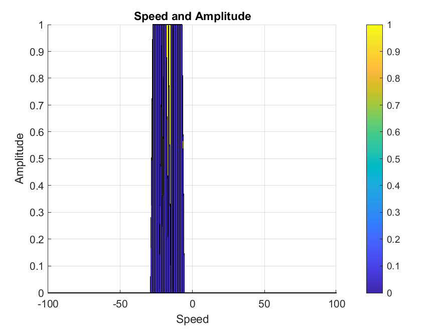

# SFND Radar Target Generation and Detection


* Code Details:
1. [Matlab m script](./radar_target_generation_and_detection.m#L1)
2. [Matlab live script](./radar_target_generation_and_detection.mlx)

[Rubric Points ](https://review.udacity.com/#!/rubrics/2548/view) for the project.


**1. Implementation steps for the 2D CFAR process:**

A false alarm is an erroneous radar target detection which is caused by noise or any other interfering signals which exceeds the threshold detection. Dynamic threshold calculates multiple threshold level which helps in reducing false alarm rate.

2D CFAR is a dynamic thresholding techinique.  With this technique, the noise at every or group of range/doppler bins is monitored and the signal is compared to the local noise level. This comparison is used create a threshold which holds the false alarm rate constant. 

The false alarm issue can be resolved by implementing the constant false alarm rate. CFAR varies the detection threshold based on the vehicle surroundings. The CFAR technique estimates the level of interference in radar range and doppler cells “Training Cells” on either or both the side of the “Cell Under Test”. The estimate is then used to decide if the target is in the Cell Under Test (CUT).

<p align="center"></p>

## 2D CFAR Steps

1. **FMCW Configuration:**
Using given specification design the FMCW waveform. Thereafter, compute the bandwidth, chirp time and slope.

```m
    Rt = 110; % m
    Vt = -20; % m/s
    d_Resolution = 1; % m
    c = 3e8; % m/s
    max_radar_range = 200;
    max_radar_velocity = 100;

    %Design the FMCW waveform by giving the specs of each of its parameters.
    % Calculate the Bandwidth (B), Chirp Time (Tchirp) and Slope (slope) of the FMCW
    % chirp using the requirements above.
    B = c/2*d_Resolution;

    Tchirp = ( 5.5 * 2 * max_radar_range ) / c;

    slope = B / Tchirp;
    %Operating carrier frequency of Radar 
    fc= 77e9;             %carrier freq

                                                            
    %The number of chirps in one sequence. Its ideal to have 2^ value for the ease of running the FFT
    %for Doppler Estimation. 
    Nd=128;                   % #of doppler cells OR #of sent periods % number of chirps

    %The number of samples on each chirp. 
    Nr=1024;                  %for length of time OR # of range cells

    % Timestamp for running the displacement scenario for every sample on each
    % chirp
    t=linspace(0,Nd*Tchirp,Nr*Nd); %total time for samples


    %Creating the vectors for Tx, Rx and Mix based on the total samples input.
    Tx=zeros(1,length(t)); %transmitted signal
    Rx=zeros(1,length(t)); %received signal
    Mix = zeros(1,length(t)); %beat signal

    %Similar vectors for range_covered and time delay.
    r_t=zeros(1,length(t));
    td=zeros(1,length(t));`
```

2. **Moving Target Generation and Signal Propogation: (Simulation Loop)**

Create a transmitted and receiver signal based on the wave equation provided in the project specs, i.e 

* **Transmitted Signal: Tx=cos(2π(fct+ 2αt 2))**
* **Received Signal   : Rx=cos(2π(fc(t−τ)+ 2α(t−τ)2))**

```m
    for i=1:length(t)
        
        %For each time stamp update the Range of the Target for constant velocity. 
        r_t(i) = Rt + Vt*t(i);
        td(i) = 2*r_t(i)/c;
        
        %For each time sample we need update the transmitted and
        %received signal. 
        Tx(i) = cos( 2*pi*( fc*t(i) + 0.5*slope*t(i)^2) );
        Rx(i) = cos( 2*pi*( fc*(t(i)-td(i)) + 0.5*slope*(t(i)-td(i))^2));
            
        %Now by mixing the Transmit and Receive generate the beat signal
        %This is done by element wise matrix multiplication of Transmit and
        %Receiver Signal
        Mix(i) = (Tx(i).*Rx(i));
        
    end
```

Generated signals:

<p align="center"></p>

3. **Range Measurement (1D FFT calculation):**

```m
    %reshape the vector into Nr*Nr array. Nr and Nd here would also define the size of
    %Range and Doppler FFT respectively.

    signal = reshape(Mix,Nr,Nd);

    %run the FFT on the beat signal along the range bins dimension (Nr) and
    %normalize.
    % Call only 1D FFT
    signal_fft = fft(signal,Nr)./Nr;

    % Take the absolute value of FFT output
    signal_fft = abs(signal_fft);

    % Output of FFT is double sided signal, but we are interested in only one side of the spectrum.
    % Hence we throw out half of the samples.
    signal_fft = signal_fft(1:(Nr/2));
```

1D FFT result:

<p align="center"></p>

4. **2D FFT (Range/Doppler FFT):**

```m
    % Range Doppler Map Generation.

    % The output of the 2D FFT is an image that has reponse in the range and
    % doppler FFT bins. So, it is important to convert the axis from bin sizes
    % to range and doppler based on their Max values.

    Mix=reshape(Mix,[Nr,Nd]);

    % 2D FFT using the FFT size for both dimensions.
    sig_fft2 = fft2(Mix,Nr,Nd);

    % Taking just one side of signal from Range dimension.
    sig_fft2 = sig_fft2(1:Nr/2,1:Nd);
    sig_fft2 = fftshift (sig_fft2);
    RDM = abs(sig_fft2);
    RDM = 10*log10(RDM) ;

```

<p align="center"></p>

5. **CFAR Implementation**

    * Determine the number of Training cells for each dimension. Similarly, pick the number of guard cells.
    * Slide the cell under test across the complete matrix. Make sure the CUT has margin for Training and Guard cells from the edges.
    * For every iteration sum the signal level within all the training cells. To sum convert the value from logarithmic to linear using db2pow function.
    * Average the summed values for all of the training cells used. After averaging convert it back to logarithmic using pow2db.
    * Further add the offset to it to determine the threshold.
    * Next, compare the signal under CUT against this threshold.
    * If the CUT level > threshold assign it a value of 1, else equate it to 0.
```m
    %Select the number of Training Cells in both the dimensions.
    Tr = 10; % Tried: 10;
    Td = 8;  % Tried: 4;


    %Select the number of Guard Cells in both dimensions around the Cell under 
    %test (CUT) for accurate estimation
    Gr = 4; % Tried: 5
    Gd = 4; % Tried: 2

    % offset the threshold by SNR value in dB
    % Tried values {4, 6}
    offset=1.4;

    % Use RDM[x,y] as the matrix from the output of 2D FFT for implementing
    % CFAR
    % Normalise
    RDM = RDM/max(max(RDM));

    for x = Tr+Gr+1:(Nr/2)-(Tr+Gr)
        for y = Td+Gd+1:Nd-(Td+Gd)
            noise_level = zeros(1,1);
            
            % Check aggregate noise around CUT
            % Iterate x until CUT +- Training and Guard range cells
            for i = x - (Tr+Gr): x + (Tr+Gr)
                % Iterate y until CUT +- Training and Guard doppler cells
                for j = y - (Td+Gd): y + (Td+Gd)
                    % Everything but Guard cell
                    if( ( abs(x -i) > Gr ) || ( abs(y-j) > Gd ) )
                        % add signal level converted to linear
                        noise_level = noise_level + db2pow(RDM(i,j));
                    end
                end
            end
            
            %  Convert to logarithmic using pow2db and add to offset
            threshold = pow2db(noise_level/(2*(Td+Gd+1)*2*(Tr+Gr+1)-(Gr*Gd)-1));
            threshold = threshold + offset;

            % Cell Under Test
            CUT = RDM(x,y);
            
            % Threshold check and assign true and false accordingly
            if( CUT <= threshold )
                RDM(x,y) = 0;
            else
                RDM(x,y) = 1;
            end
        end
    end

    % The process above will generate a thresholded block, which is smaller 
    %than the Range Doppler Map as the CUT cannot be located at the edges of
    %matrix. Hence,few cells will not be thresholded. To keep the map size same
    % set those values to 0. 

    RDM(RDM~=0 & RDM~=1) = 0;
```

**CFAR Results:**


<p align="center">
    
    
    
</p>

**2. Selection of Training, Guard cells and offset.**

* Training Cells : The level of noise is measured over the Training Cells. The Training Cells can be divided into two regions, the cells lagging the CUT, called lagging Training Cells and the cells leading the CUT, called Leading Training Cells. The noise is estimated by averaging the noise under the training cells. In some cases either leading or lagging cell average is taken, while in the other the leading and lagging cell average is combined and the higher of two is considered for noise level estimate. 
The number of training cells should be decided based on the environment. If a dense traffic scenario then the fewer training cells should be used, as closely spaced targets can impact the noise estimate.

* Guard Cells : The cells just next to CUT are assigned as Guard Cells. The purpose of the Guard Cells is to avoid the target signal from leaking into the training cells that could adversely affect the noise estimate. The number of guard cells should be decided based on the leakage of the target signal out of the cell under test. If target reflections are strong they often get into surrounding bins.

* Threshold Factor (Offset) : Use an offset value to scale the noise threshold. If the signal strength is defined in logarithmic form then add this offset value to the average noise estimate, else multiply it.

<p align="center"></p>

I tried few combinations of training cells, guard cells and offet. The comparison of the output is below:

**1st Combination**
* Training cells for doppler dimension (Td) = 8
* Training cells for range dimension (Tr) = 10
* Guard cells for doppler dimension (Gd) = 4
* Guard cells for range dimension (Gr) = 4
* offset = 1.4

| CFAR Surface Plot | Range and Amplitude | Speed and Amplitude |
| ----------------- | ------------------- | ------------------- |
||  | |

**2nd Combination**
* Training cells for doppler dimension (Td) = 4
* Training cells for range dimension (Tr) = 10
* Guard cells for doppler dimension (Gd) = 2
* Guard cells for range dimension (Gr) = 5
* offset = 1.4

| CFAR Surface Plot | Range and Amplitude | Speed and Amplitude |
| ----------------- | ------------------- | ------------------- |
||  | |

**3. Steps taken to suppress the non-thresholded cells at the edges.**

The process above will generate a thresholded block, which is smaller than the Range Doppler Map as the CUT cannot be located at the edges of matrix. Hence,few cells will not be thresholded. To keep the map size same set those values to 0. 

Thus, any values which arent 0 or 1, will be marked as 0.

```m
    RDM(RDM~=0 & RDM~=1) = 0;
```

Reference:

1. Udacity Lecture Notes: https://classroom.udacity.com/nanodegrees/nd313/parts/0701cbc4-73a7-4e19-895a-0bd0695f0365/modules/b52e21b1-f7ef-434a-9378-58b75dfa6800/lessons/ceac76ed-eb0e-4fb0-a7ce-0434f6e524cd/concepts/33847fdb-3e88-4852-a446-b1c6270a3c10